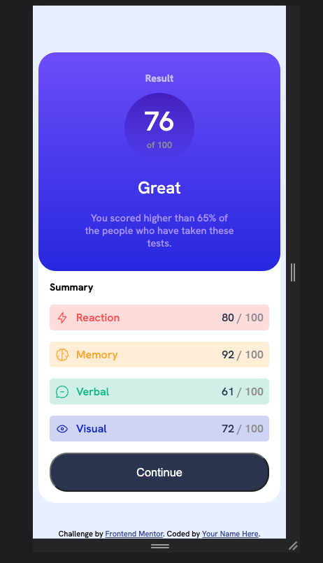
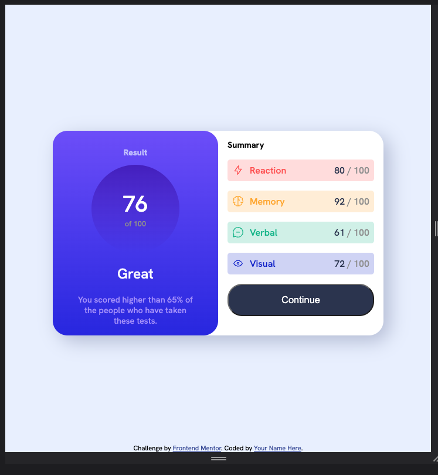

# Frontend Mentor - Results summary component solution

This is a solution to the [Results summary component challenge on Frontend Mentor](https://www.frontendmentor.io/challenges/results-summary-component-CE_K6s0maV). Frontend Mentor challenges help you improve your coding skills by building realistic projects. 

## Table of contents

- [Overview](#overview)
  - [The challenge](#the-challenge)
  - [Screenshot](#screenshot)
  - [Links](#links)
- [My process](#my-process)
  - [Built with](#built-with)
  - [What I learned](#what-i-learned)
- [Author](#author)

**Note: Delete this note and update the table of contents based on what sections you keep.**

## Overview

### The challenge

Users should be able to:

- View the optimal layout for the interface depending on their device's screen size
- See hover and focus states for all interactive elements on the page

### Screenshot

### Links

- Solution URL: https://github.com/Mafaii/Frontend-Mentor---Results-summary-component-solution
- Live Site URL: https://mafaii.github.io/Frontend-Mentor---Results-summary-component-solution/

## My process

- look at both design and compare them (to find basic info what will go to media queries)
- add html
- start with css
- add more html as needed and complete css for it
- add @media query
- fix all problems

### Built with

- Semantic HTML5 markup
- CSS custom properties
- Flexbox
- Mobile-first workflow

### What I learned

- that i cant see colors....
- without figma its kinda hard to get correct values/colors
- margin is quite useful

